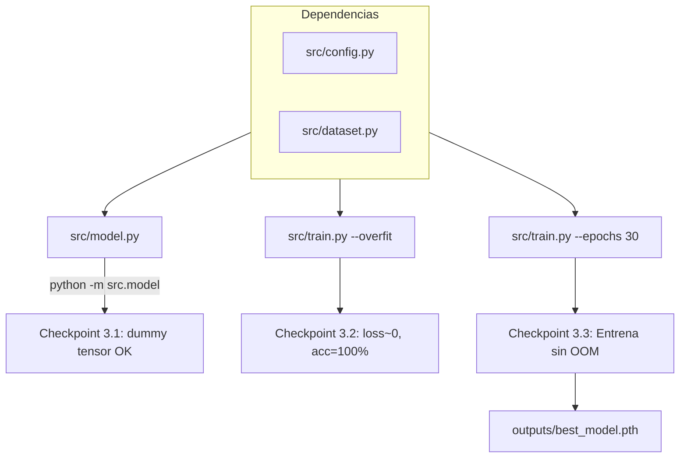

# Sprint 3: Modelado y Training Loop

## 3.1 Nuevo archivo: `src/model.py` -- Simple3DCNN

Clase `Simple3DCNN(nn.Module)` con 4 bloques convolucionales y un clasificador:

```python
# Progresion de canales: 1 -> 32 -> 64 -> 128 -> 256
# Input: (B, 1, 96, 96, 96)

Block 1: Conv3d(1, 32, 3, p=1) -> BN3d -> ReLU -> MaxPool3d(2)   => (B, 32, 48, 48, 48)
Block 2: Conv3d(32, 64, 3, p=1) -> BN3d -> ReLU -> MaxPool3d(2)  => (B, 64, 24, 24, 24)
Block 3: Conv3d(64, 128, 3, p=1) -> BN3d -> ReLU -> MaxPool3d(2) => (B, 128, 12, 12, 12)
Block 4: Conv3d(128, 256, 3, p=1) -> BN3d -> ReLU -> MaxPool3d(2)=> (B, 256, 6, 6, 6)

AdaptiveAvgPool3d(1) => (B, 256, 1, 1, 1)
Flatten             => (B, 256)
Dropout(0.5)        => (B, 256)
Linear(256, 3)      => (B, 3)
```

- Se incluye un `Dropout(0.5)` antes de la capa lineal para regularizacion.
- `num_classes` parametrizable, por defecto `cfg.NUM_CLASSES` (3).
- Usar `nn.Sequential` para cada bloque para mantener el codigo limpio.

**Checkpoint 3.1:** Al final del archivo, un bloque `if __name__ == "__main__"` que pasa un `torch.randn(1, 1, 96, 96, 96)` y verifica que la salida sea `(1, 3)`.

## 3.2 Nuevo archivo: `src/train.py` -- Training loop

Script de entrenamiento con las siguientes funciones:

### `compute_class_weights(split="train") -> torch.Tensor`

Calcula pesos inversamente proporcionales a la frecuencia de cada clase a partir del CSV de train. Con la distribucion actual (CN=94, MCI=49, AD=21):

- Usa la formula: `weight_i = N_total / (N_classes * N_i)`
- Resultado aproximado: `[0.58, 1.11, 2.60]` (penaliza mas la clase minoritaria AD)

### `train_one_epoch(model, loader, criterion, optimizer, device) -> dict`

Un epoch completo de entrenamiento. Retorna dict con `loss` y `accuracy` medias.

### `evaluate(model, loader, criterion, device) -> dict`

Evaluacion sin gradientes. Retorna dict con `loss` y `accuracy`.

### `train(num_epochs, overfit_one_batch=False) -> None`

Funcion principal que:

1. Detecta device (`cuda` si disponible, si no `cpu`)
2. Crea modelo, lo mueve al device
3. Calcula class weights y crea `CrossEntropyLoss(weight=...)`
4. Crea optimizer `Adam(lr=cfg.LEARNING_RATE)`
5. Carga DataLoaders (train y val)
6. Si `overfit_one_batch=True`: toma un solo batch de 4 imagenes y entrena 100 epochs sobre el (sin validacion)
7. Si no: entrena `num_epochs` con loop train/val completo
8. Guarda el mejor modelo (menor val_loss) en `outputs/best_model.pth`
9. Imprime metricas por epoch

### Estructura del `__main__`

```python
if __name__ == "__main__":
    import argparse
    parser = argparse.ArgumentParser()
    parser.add_argument("--epochs", type=int, default=cfg.NUM_EPOCHS)
    parser.add_argument("--overfit", action="store_true")
    args = parser.parse_args()
    train(num_epochs=args.epochs, overfit_one_batch=args.overfit)
```

Esto permite ejecutar:

- `python -m src.train --overfit` para el test de overfit (3.2)
- `python -m src.train --epochs 30` para entrenamiento completo (3.3)

## 3.3 Notebook: `notebooks/02_overfit_one_batch.ipynb`

Notebook ligero para ejecutar y visualizar el test de overfit-one-batch interactivamente:

- Celda 1: Crear modelo, cargar 1 batch (4 imagenes), entrenar 100 epochs
- Celda 2: Graficar curva de loss (debe bajar a ~0.0) y accuracy (debe subir a 100%)
- Celda 3: Assert de que loss < 0.05 y accuracy == 1.0

## Archivos afectados

- **Crear**: [src/model.py](src/model.py) -- arquitectura Simple3DCNN
- **Crear**: [src/train.py](src/train.py) -- training loop con class weights y checkpointing
- **Crear**: [notebooks/02_overfit_one_batch.ipynb](notebooks/02_overfit_one_batch.ipynb) -- verificacion visual del overfit test
- **Sin cambios**: [src/config.py](src/config.py) (ya tiene `LEARNING_RATE`, `NUM_EPOCHS`, `BATCH_SIZE`, `NUM_CLASSES`)
- **Sin cambios**: [src/dataset.py](src/dataset.py) (ya provee los DataLoaders)

## Flujo de ejecucion




