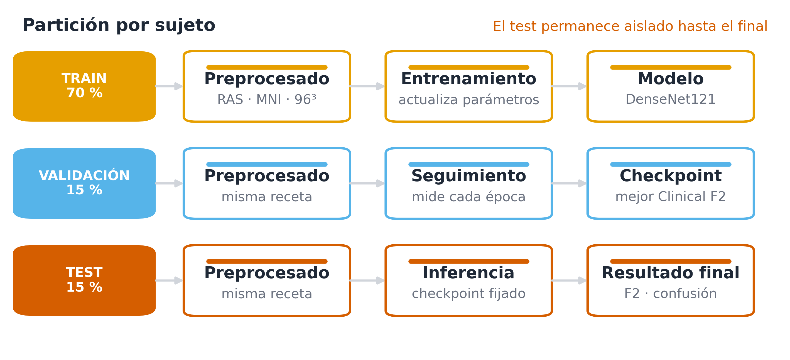
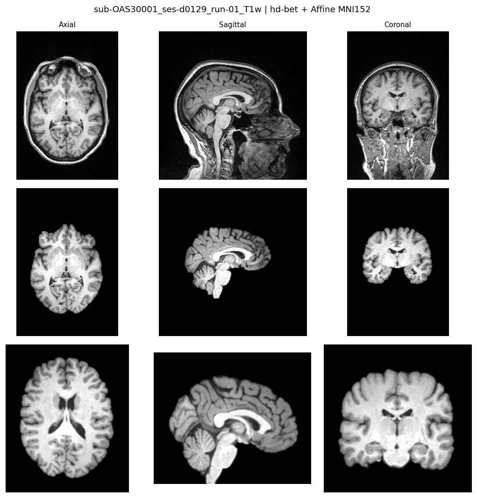
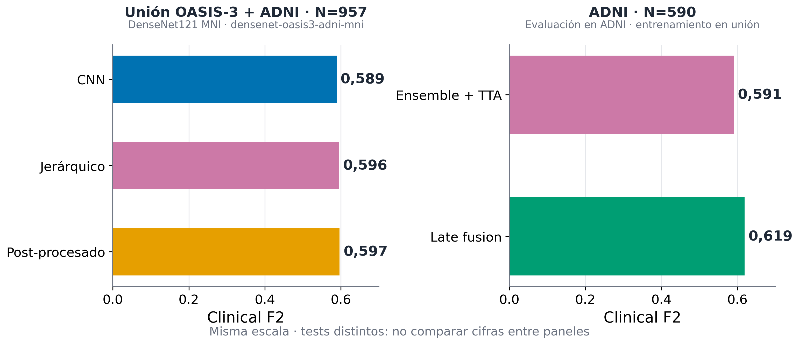

# Deteccion temprana de Alzheimer con CNN 3D sobre MRI estructural

Trabajo de Fin de Grado (Universidad de Oviedo). Autor: **Alfredo Flórez de la Vega**.

Pipeline reproducible para clasificar resonancias magneticas cerebrales 3D en tres
estadios clinicos segun CDR: **CN** (CDR=0), **MCI** (CDR=0,5) y **AD** (CDR>=1).
Soporta cohortes **OASIS-3**, **ADNI** y uniones cross-dataset.

<p align="center">
  
</p>

> **Version publica reproducible:** este repositorio contiene un snapshot limpio del
> codigo utilizado en el TFG. No incluye datos medicos, pesos entrenados ni el historial
> interno de desarrollo.

## Caracteristicas principales

| Aspecto | Detalle |
|---------|---------|
| Modelos | `densenet121`, `resnet10`, `densenet121_coral`, `multimodal_densenet`, `ultimate_fm`, `efficientnet25d` |
| Preprocesado | `cropped`, `mni`, `mni_n4`, `mni_128` (offline a tensores `.pt`) |
| Seleccion de checkpoint | **val clinical F2** (beta=2, ponderado AD/MCI/CN) |
| Post-procesado | Late fusion (XGBoost), ensemble, TTA, umbrales, cascada binaria |
| Semilla | `RANDOM_SEED=42` en `src/config.py` |

## Preprocesado espacial (MNI)

Evolucion de una T1w: volumen original, cerebro extraido (`hd-bet`) y registro afin a MNI152
(planos axial, sagital y coronal). La variante `mni_n4` anade correccion de bias field N4
tras la extraccion.

<p align="center">
  
</p>

## Resultados (vista rapida)

Clinical F2 en las cohortes principales del TFG (tests distintos: no comparar cifras entre paneles).

<p align="center">
  
</p>

## Inicio rapido

```bash
git clone https://github.com/alfredofdlv/Deteccion-de-Alzheimer-con-MRI-3D.git
cd Deteccion-de-Alzheimer-con-MRI-3D

python -m venv .venv
source .venv/bin/activate

# PyTorch con CUDA (ajusta la URL a tu version): https://pytorch.org
pip install torch torchvision --index-url https://download.pytorch.org/whl/cu126
pip install -r requirements.txt

# Smoke test (sin datos)
python -m src.model
python run_pipeline.py --help
```

Los datos medicos **no** estan incluidos. Guia de instalacion y datos:
[`REPRODUCIBILITY.md`](REPRODUCIBILITY.md). Referencia de comandos: [`CLI.md`](CLI.md).

## Estructura del proyecto

```
.
├── src/                    # Modelos, entrenamiento, evaluacion, metricas
├── scripts/                # Preprocesado, splits, utilidades ADNI/OASIS
├── assets/                 # Figuras del README
├── run_pipeline.py         # CLI: train -> evaluate -> (late fusion / export)
├── benchmark.py            # Medicion de tiempos
├── export_context.py       # Exportar codigo del run a Markdown
├── requirements.txt        # Dependencias principales
├── requirements-optional.txt  # MNI/N4 (ANTs, HD-BET)
├── REPRODUCIBILITY.md      # Guia completa de reproduccion
├── CLI.md                  # Referencia de comandos (run_pipeline, train, ...)
├── data/                   # Datos locales (ignorado por git)
└── outputs/                # Resultados de experimentos (ignorado por git)
```

## Ejemplo minimo (OASIS-3)

Tras obtener los NIfTI y generar splits (ver REPRODUCIBILITY):

```bash
python scripts/preprocess_to_pt.py --dataset oasis3 --variant cropped
python run_pipeline.py mi-run --dataset oasis3 --model densenet121 --no-export
python -m src.evaluate --run mi-run --dataset oasis3 --model densenet121
```

Mas opciones y flags en [`CLI.md`](CLI.md).

## Documentacion

| Archivo | Contenido |
|---------|-----------|
| [`REPRODUCIBILITY.md`](REPRODUCIBILITY.md) | Instalacion, datos, preprocesado, experimentos clave, metricas |
| [`CLI.md`](CLI.md) | Referencia de CLI (`run_pipeline`, train, evaluate, late fusion, ...) |
| [`LICENSE`](LICENSE) | MIT + aviso sobre datos medicos |

## Cita

```bibtex
@misc{florez2026alzheimer3dmri,
  author       = {Fl{\'o}rez de la Vega, Alfredo},
  title        = {Deteccion temprana de Alzheimer mediante CNN 3D sobre MRI estructural},
  year         = {2026},
  howpublished = {Trabajo de Fin de Grado, Universidad de Oviedo},
  url          = {https://github.com/alfredofdlv/Deteccion-de-Alzheimer-con-MRI-3D}
}
```

## Licencia

Codigo bajo [MIT License](LICENSE). Los datos OASIS/ADNI tienen sus propios acuerdos
de uso; no se redistribuyen en este repositorio.
